# Cubric Fight!
**************************************************************************************************************
<article>
#Team : Team.Cube 
#Game Title : Cubric Fight! 
#Genre : 3D strategy action board game 
#Member : 1 Game Designer, 3 Programmer  
#Production Period : 2018/09/07 
#Publish : None 
#Engin : Unity3D
#Language : C#
</article>

<body>
  <h2>요약</h2>
  

    <h4>프로젝트</h4>
    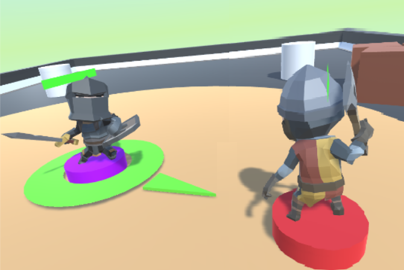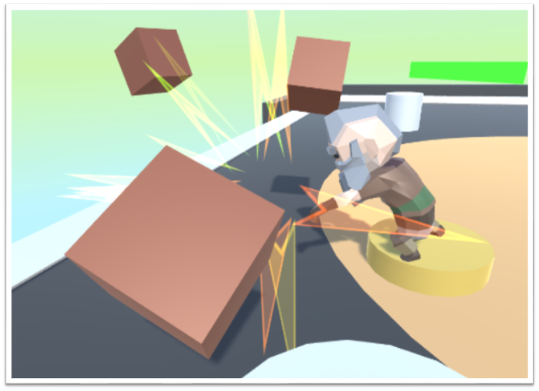
    

      간단한 <b>모바일 보드 게임</b>을 제작하는 것을 목표로한 프로젝트입니다. 
      알까기와 유사한 이 보드게임은 상대를 밀어 맵 밖으로 보내는 것이 아닌 캐릭터를 날려 속도에 비례하여 적과 충돌하여 데미지를 주거나 각 캐릭터 고유의 스킬을 활용하여 데미지나 전략적 우의를 차지하여 적의 체력이 고갈시켜 적을 모두 처치하면 이기는 게임입니다.
    

     
    <h4>캐릭터 및 스킬</h4>
    
      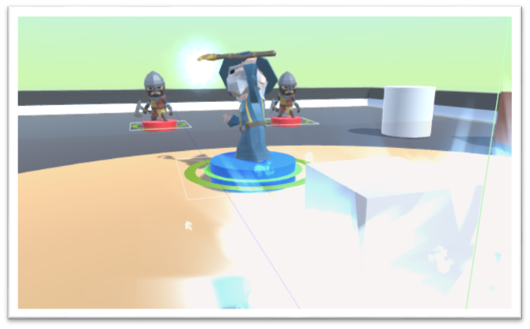
      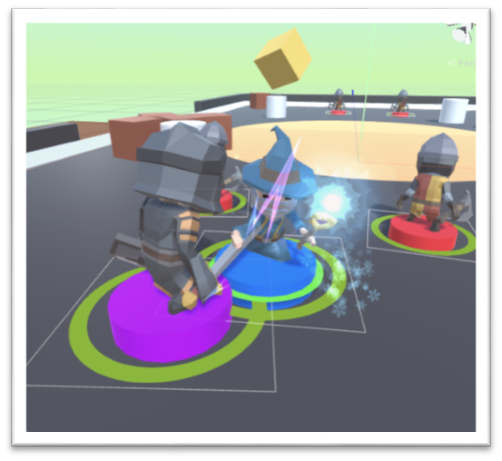
    
    

      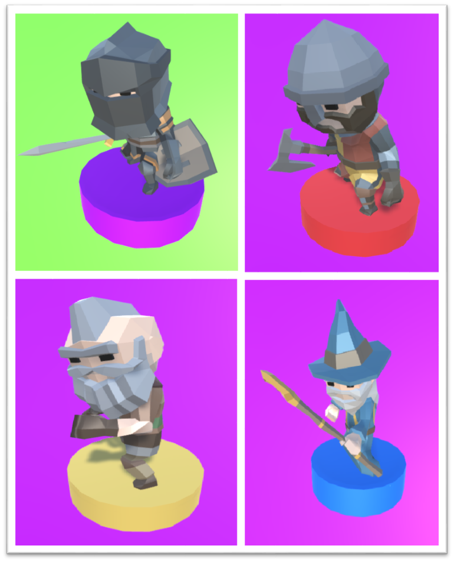
      각 <b>캐릭터는 고유 스킬들은 범위공격, 장애물 설치 등</b>과 같은 효과가 있으며 <b>필요에 따라 전략적이게 사용 가능</b>하기 때문에 단순한 힘의 조절만으로 하는 게임에서 좀더 전략성을 추구하였습니다. 또한 <b>각 플레이어는 동작 가능 횟수(Cost)가 주어지며</b> 이를 통해 <b>매 동작에 신중</b>해질 것이며 유니티에서 사용가능한 네트워크 서버인 포톤(Photon)을 활용하여 <b>1대1대전</b>이 가능하도록 하였습니다. 
    

     
    <h4>보스대전</h4>
    

      작성자는 이 프로젝트에 <b>"보스대전" 컨텐츠</b>의 보스의 AI에 <b>유한행동기계와 맵 디자인 및 레벨 디자인</b>을 제작 및 관리하였습니다.
    

    
      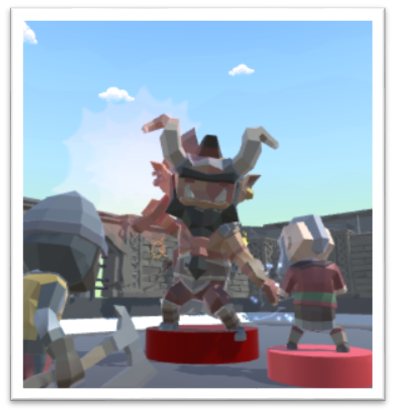
      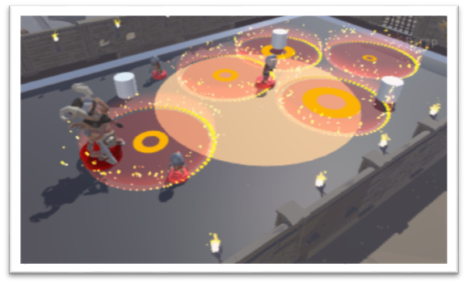
      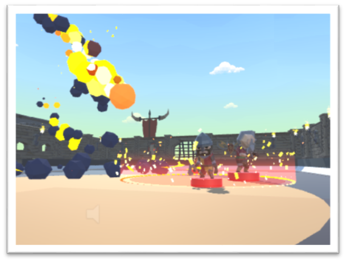
    
  

  
  <h2>제작 역할</h2>
  

    <ol>
      <li><h3>보스 컨트롤러</h3> 
      - 보스 캐릭터의 기본적인 스탯과 추가적 생성할 보스들에게도 공통적으로 반드시 필요한 변수와 함수를 추상클래스로 구현한 컨트롤러를 제작하였습니다. 또한 충돌하면 반대의 각도로 다시 튕겨내기 위해 반사 벡터를 연산하여 체스를 튕겨내는 간단한 연산정도가 포함되어 있습니다.(OrcChif_AI.cs) 
        
          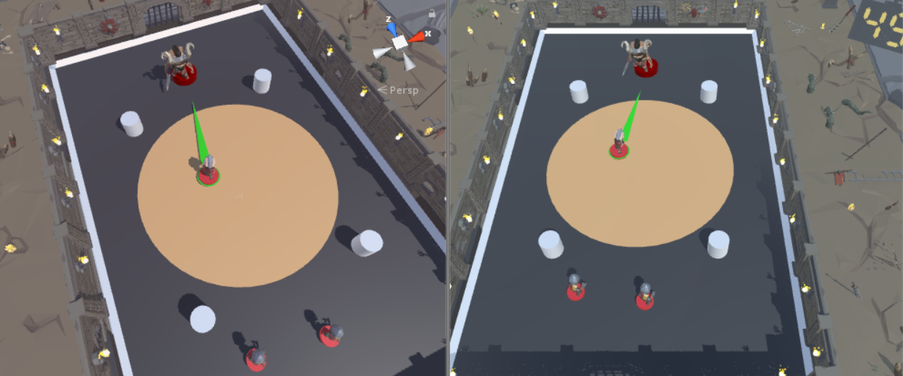
          
        
      </li>
       
      <li><h3>보스 유한행동기계 제작</h3> 
        보스는 총 3가지의 공격 패턴을 지니고 있습니다. 
        <ul>
          <li><h5>근접 공격</h5>
          - 플레이어의 캐릭터가 근접공격 범위 안에 존재하면 전/후/좌/우 중 캐릭터가 존재하는 위치의 90도 범위를 공격합니다. 
              
                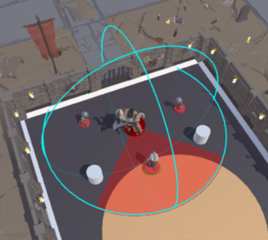
                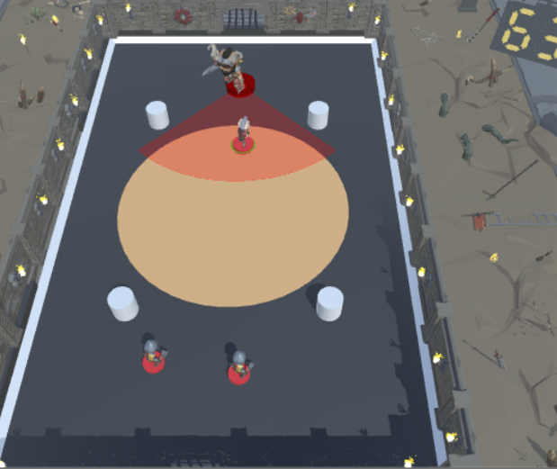
               
          - 만일 전/후/좌/우 중 다방향에 캐릭터가 골고루 존재한다면 데이터를 종합하여 그 중 랜덤하게 한 방향을 공격합니다. 
            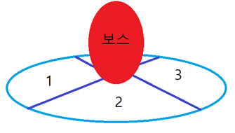
             
          </li>
          <li><h5>원거리 공격</h5>
          - 플레이어의 캐릭터가 근접공격 범위 밖에 존재하면 범위 밖 캐릭터 중 하나에 랜덤으로 세로 혹은 가로방향으로 공격합니다. 
          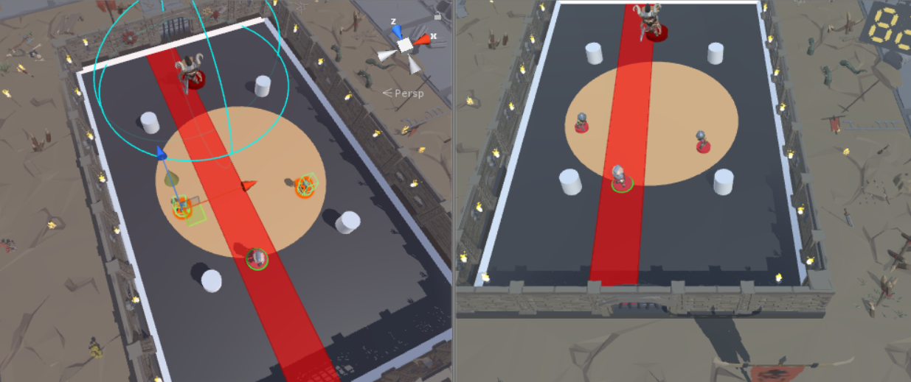
          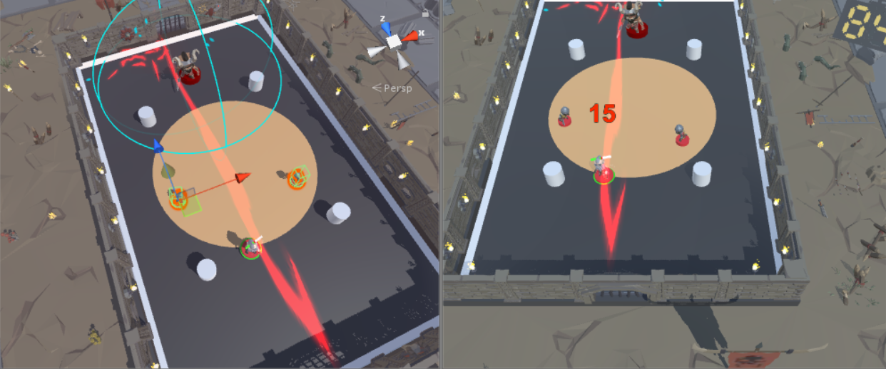
           
          </li>
          <li><h5>운석 공격</h5>
          - 보스의 체력이 1/4로 떨어지면 발생되는 패턴으로 <b>5개의 운석을 소환하여 범위 피해</b>를 줍니다. 
          - <b>생존한 플레이어 캐릭 중 하나</b>와 <b>서로 겹치지 않는 랜덤한 위치 4곳</b>에 떨어집니다. 
          - 각 운석은 떨어지는 딜레이가 달라 플레이어가 육안으로 먼저 피해야하는 곳을 알아보도록 원형 타이머를 시각화하여 피할 수 있도록 하였습니다. 
          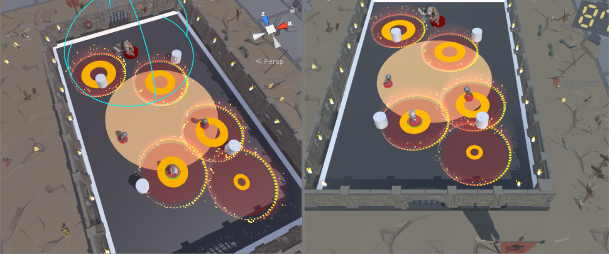
          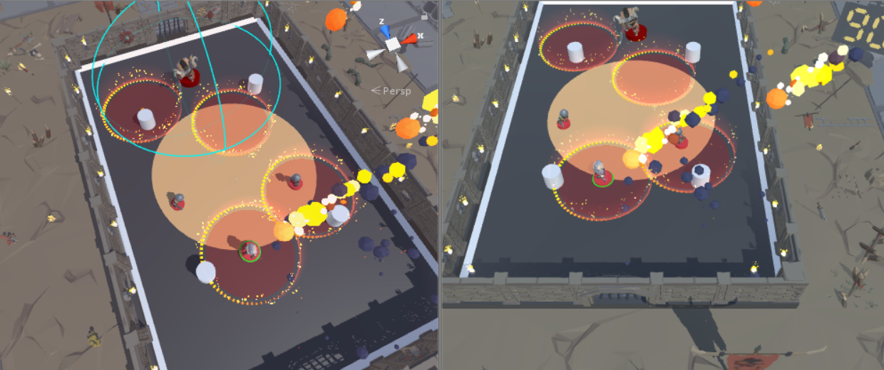
          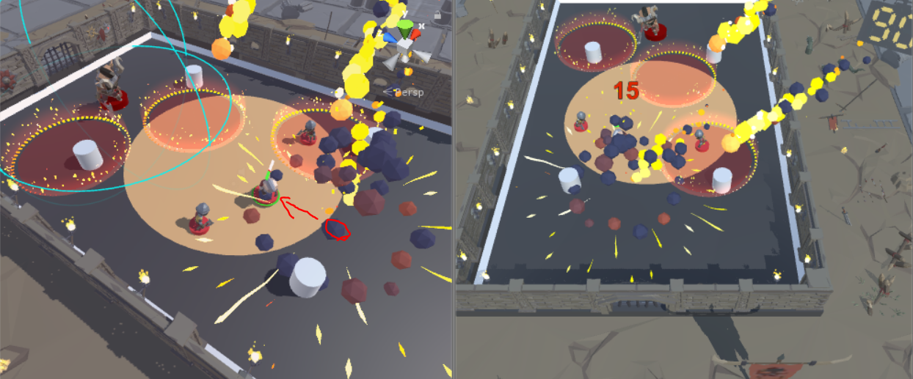
           
          </li>
        </ul>
        

        위 세가지 패턴을 지정된 시간마다 번갈아가며 발동합니다. 
        예를들어 근접+원거리 공격을 30초정도 반복하며 30초가 지나면 운석 패턴을 10초동안 활성화 시키는 방식으로 행동기계를 작성하였습니다. 
        

      </li>
    </ol>
  

  
  <h2>게임 영상</h2>
  
  
  
   
</body>
